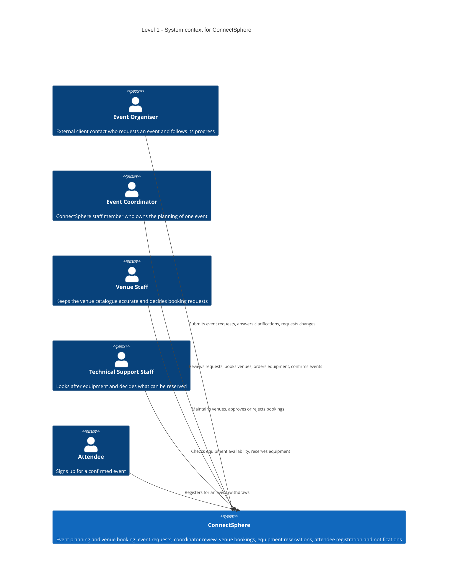
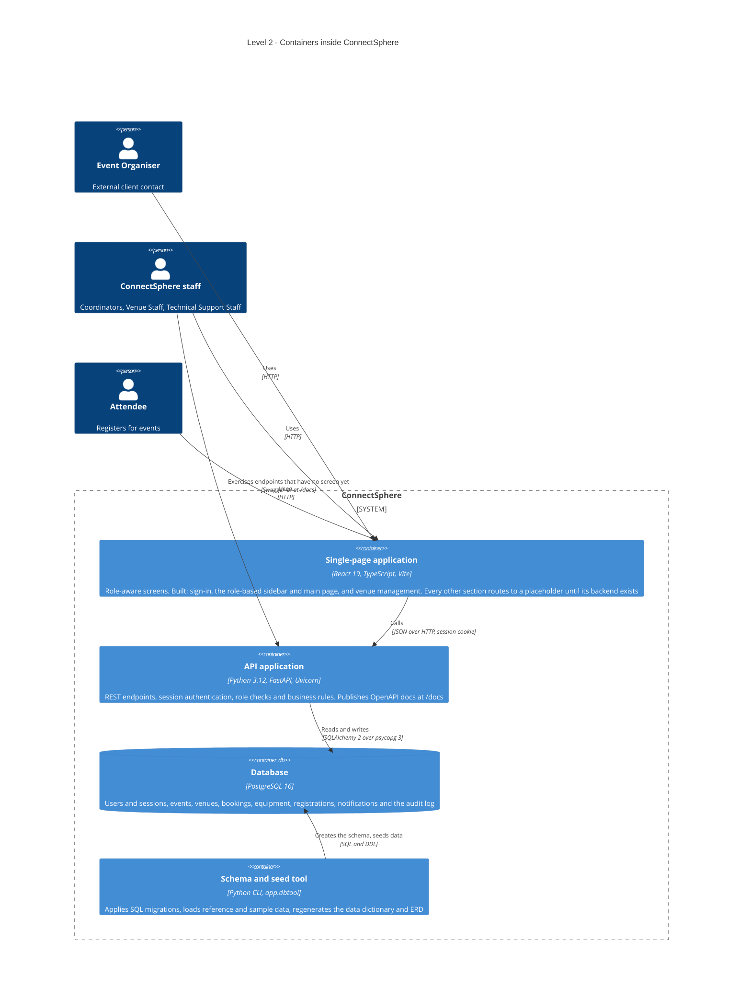
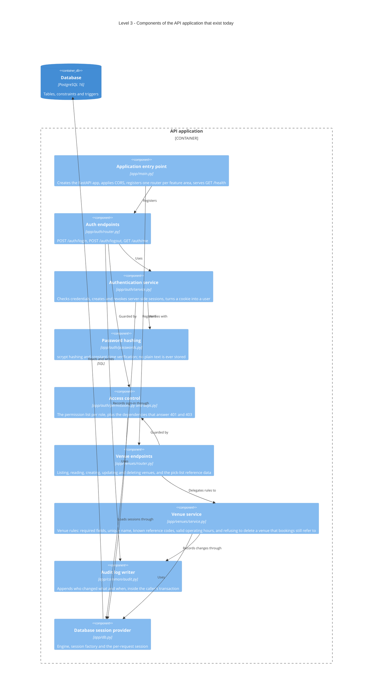
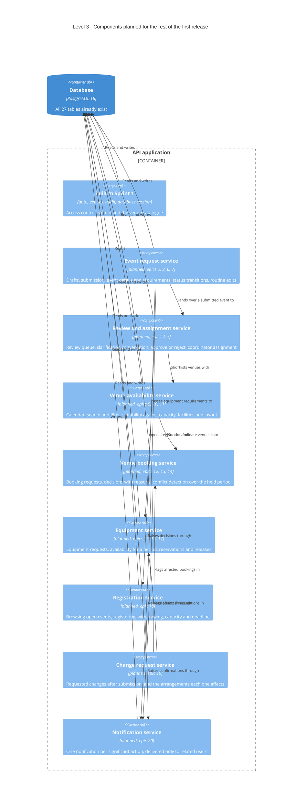
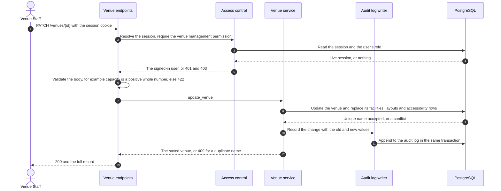
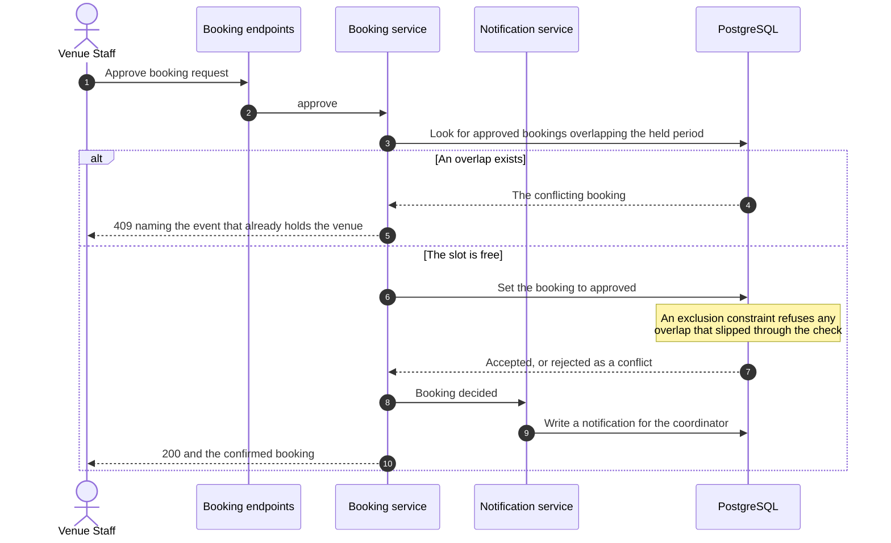
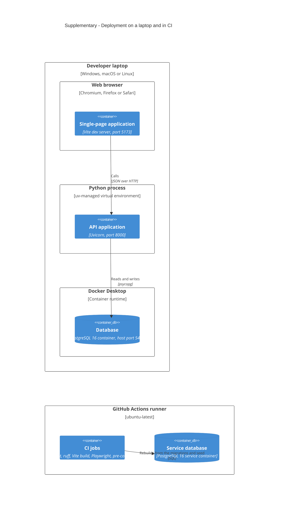

# C4 model

How ConnectSphere is put together, described with the [C4 model](https://c4model.com): context,
containers, components, plus a dynamic and a deployment view. The scope is the **first release**,
the 20 core features listed in the Week 4 project instructions.

This file is written by hand. The data dictionary and ERD under `docs/database/` are generated
from the live schema and describe the data; this file describes the software.

## How to read it

- **Built** means code exists in the repository today: stories 1, 1.1, 1.2 and 8.3.
- **Planned** means the backlog asks for it and the database already has its tables, but no
  application code exists yet. The schema deliberately runs ahead of the code, so a table is not
  evidence of a feature.
- Diagrams are Mermaid. GitHub renders them in place. In VS Code, use the Markdown Preview
  Mermaid Support extension.

## Level 1: system context

Who uses ConnectSphere and what they use it for. The first release has no external system
dependencies: notifications are in-app only, and there is no e-mail, calendar or payment
integration.

## Level 2: containers

The parts that run separately and how they talk to each other.

Each container in one line:

| Container | Technology | Responsibility |
| --- | --- | --- |
| Single-page application | React 19, TypeScript, Vite on port 5173 | Shows each role only what its permissions allow. Holds no rules of its own |
| API application | FastAPI on port 8000 | Every rule and every access decision. One module per feature area |
| Database | PostgreSQL 16 on port 5433 | The single copy of event, venue, equipment and registration data. Enforces the rules that must never be broken |
| Schema and seed tool | `python -m app.dbtool` | Migrations, seed data, and the generated data dictionary and ERD |

## Level 3: components built in Sprint 1

Inside the API application. Each feature area is a folder with a router for HTTP, a service for
rules, schemas for request and response shapes, and models for tables.

## Level 3: components the backlog still needs

The same shape, one component per remaining epic. Every one of them reuses access control, the
session provider and the audit log writer, so those links are drawn once at the boundary.

## Dynamic view: Venue Staff updates a venue

The one end-to-end path that exists today, story 8.3. It shows where each kind of refusal comes
from, which is the same pattern every later feature follows.

## Dynamic view: approving a venue booking

Planned, stories 12.1, 13.2 and 14.2. It is drawn because it is the design decision most worth
explaining: the service reports a readable conflict, and the database guarantees the rule even
when two staff members approve at the same moment.

## Deployment view

The first release is coursework and runs locally. Nothing is hosted, so this view covers a
developer machine and the CI runner.

Host port 5433 is deliberate. A PostgreSQL installed directly on a laptop usually holds 5432 and
would answer instead of the project's container.

## Core features mapped to components and tables

The 20 core features from the Week 4 instructions, the component that owns each one, and the
tables behind it. Epic numbers match the product backlog story IDs, so feature 8 is story 8.x.

| # | Core feature | Component | Main tables | State |
| --- | --- | --- | --- | --- |
| 1 | User authorisation and authentication | Auth endpoints, Authentication service, Access control | `roles`, `users`, `user_sessions` | Built |
| 2 | Event request creation | Event request service | `events`, `event_required_facilities`, `event_accessibility_needs`, `event_equipment_requests` | Planned |
| 3 | Draft event requests | Event request service | `events` with status `DRAFT` | Planned |
| 4 | Event review and approval | Review and assignment service | `events`, `event_status_history`, `event_clarifications` | Planned |
| 5 | Coordinator assignment | Review and assignment service | `event_coordinator_assignments`, `events.assigned_coordinator_id` | Planned |
| 6 | Event status management | Event request service | `events.status`, `event_status_history` | Planned |
| 7 | Event information management | Event request service, Audit log writer | `events`, `audit_log` | Planned |
| 8 | Venue catalogue | Venue endpoints, Venue service | `venues`, `venue_facilities`, `venue_layouts`, `venue_accessibility_features` | Built for create and update; browse screens pending |
| 9 | Venue availability calendar | Venue availability service | `venue_unavailability_periods`, `venue_bookings` | Planned |
| 10 | Venue search and filtering | Venue availability service | `venues` and its join tables, `venue_bookings` | Planned |
| 11 | Venue suitability checking | Venue availability service | `venues.capacity`, venue join tables against event requirements | Planned |
| 12 | Venue booking request | Venue booking service | `venue_bookings` | Planned |
| 13 | Venue booking approval | Venue booking service | `venue_bookings` decision columns | Planned |
| 14 | Booking conflict detection | Venue booking service, plus a database exclusion constraint | `venue_bookings.held_from` and `held_until` | Database rule built, service pending |
| 15 | Equipment request management | Equipment service | `event_equipment_requests`, `equipment_types` | Planned |
| 16 | Equipment availability checking | Equipment service | `equipment_types.total_quantity`, `equipment_reservations`, `equipment_unavailability_periods` | Planned |
| 17 | Equipment reservation | Equipment service | `equipment_reservations` | Planned |
| 18 | Attendee registration | Registration service | `event_registrations`, registration columns on `events` | Planned |
| 19 | Event change requests | Change request service | `event_change_requests` | Planned |
| 20 | Notification system | Notification service | `notifications` | Planned |

Auditability runs across all of them. Every significant action appends to `audit_log` through one
writer, so no feature has to invent its own history.

## Decisions these diagrams encode

- **One module per feature area, not one per technical layer.** A story touches a single folder,
  which keeps parallel work in a six-person team from colliding.
- **Rules live in services, never in routers or the UI.** A router validates shapes and maps
  errors to status codes. The single-page application decides only what to show.
- **Role permissions are a list in code; relationship rules sit in services.** "Which role may
  book a venue" is a permission. "A coordinator sees only their own events" needs the record, so
  it belongs next to it.
- **The database enforces what must never break.** Overlapping approved bookings are impossible
  because of an exclusion constraint, not because the service remembered to check.
- **Sessions live in the database.** Logging out revokes the row, so a stolen cookie stops
  working immediately.
- **The schema covers the whole backlog, the code does not.** That keeps later stories from
  needing migrations that reshape existing tables.

## Keeping this file honest

Update it when you add a feature area, change a container or move a responsibility between
components. Nothing regenerates it. The checklist in
[ARCHITECTURE.md](ARCHITECTURE.md) lists the other places a new feature has to appear.
