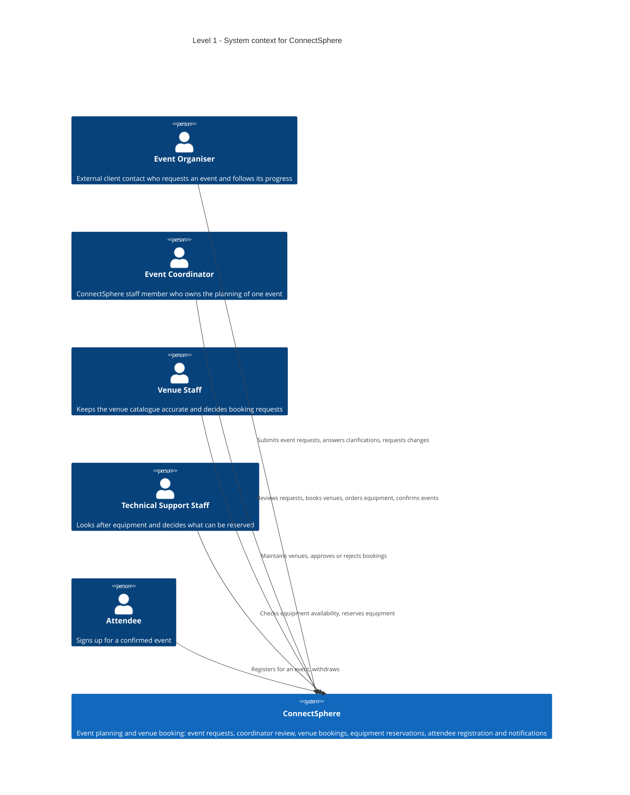
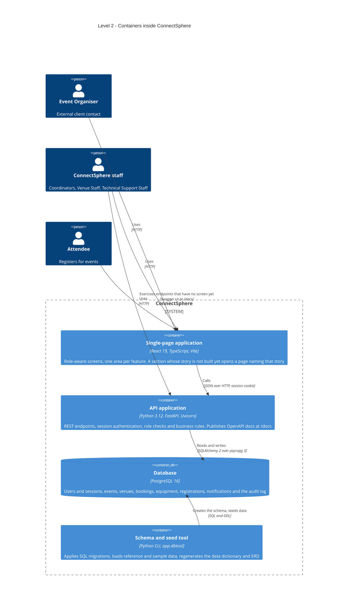
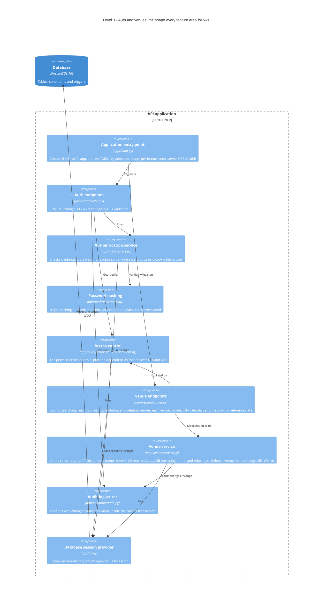
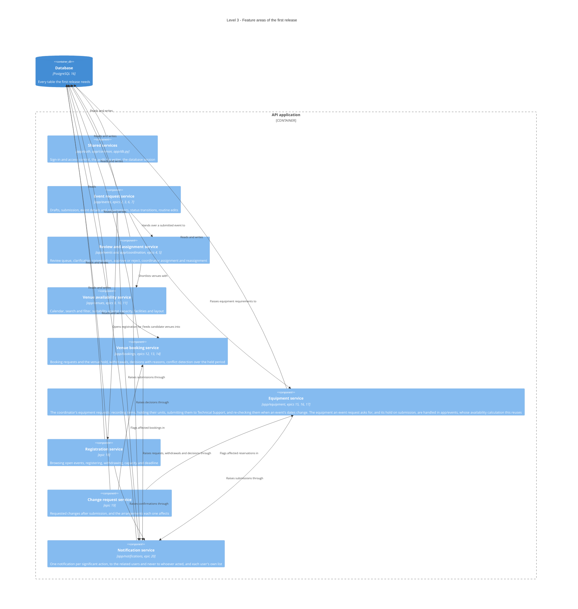
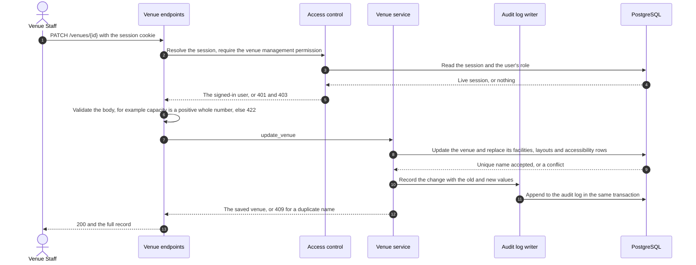
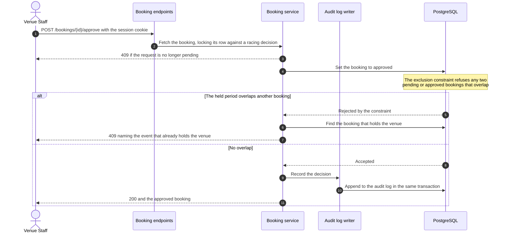
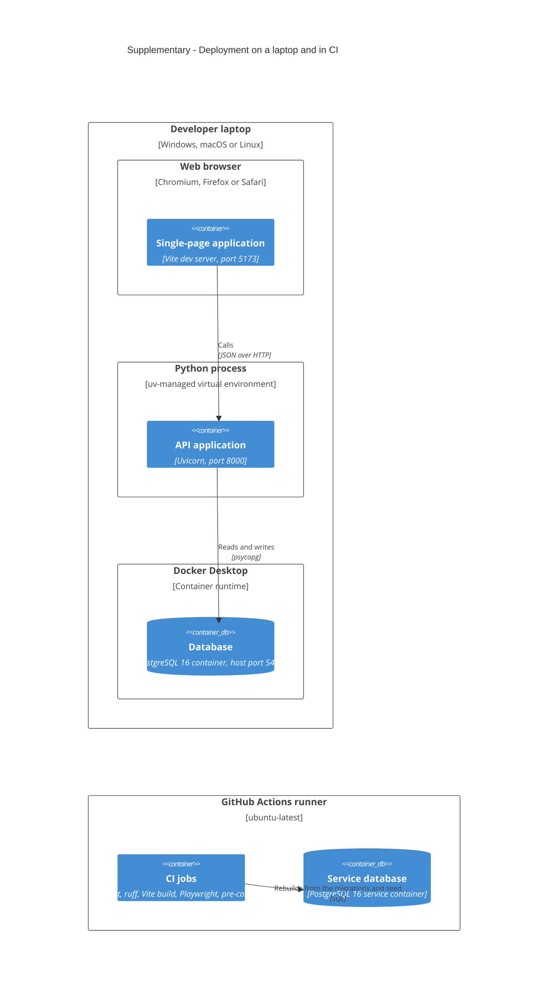

# C4 model

How ConnectSphere is put together, described with the [C4 model](https://c4model.com): context,
containers, components, plus a dynamic and a deployment view. The scope is the **first release**,
the 20 core features listed in the Week 4 project instructions.

This file is written by hand. The data dictionary and ERD under `docs/database/` are generated
from the live schema and describe the data; this file describes the software.

## How to read it

- Each component names the package that implements it, such as `app/bookings`. A component with
  no package yet names the epics it serves instead: the backlog asks for it and the database
  already has its tables, but no application code exists. The schema deliberately runs ahead of
  the code, so a table is not evidence of a feature.
- Which stories are done is tracked in the backlog, not here. This file changes when a feature
  area, a container or a responsibility does.
- Diagrams are Mermaid. GitHub renders them in place. In VS Code, use the Markdown Preview
  Mermaid Support extension.

## Level 1: system context

Who uses ConnectSphere and what they use it for. The first release has no external system
dependencies: notifications are in-app only, and there is no e-mail, calendar or payment
integration.

```mermaid
C4Context
    title Level 1 - System context for ConnectSphere

    Person(organiser, "Event Organiser", "External client contact who requests an event and follows its progress")
    Person(coordinator, "Event Coordinator", "ConnectSphere staff member who owns the planning of one event")
    Person(venueStaff, "Venue Staff", "Keeps the venue catalogue accurate and decides booking requests")
    Person(techStaff, "Technical Support Staff", "Looks after equipment and decides what can be reserved")
    Person(attendee, "Attendee", "Signs up for a confirmed event")

    System(connectsphere, "ConnectSphere", "Event planning and venue booking: event requests, coordinator review, venue bookings, equipment reservations, attendee registration and notifications")

    Rel(organiser, connectsphere, "Submits event requests, answers clarifications, requests changes")
    Rel(coordinator, connectsphere, "Reviews requests, books venues, orders equipment, confirms events")
    Rel(venueStaff, connectsphere, "Maintains venues, approves or rejects bookings")
    Rel(techStaff, connectsphere, "Checks equipment availability, reserves equipment")
    Rel(attendee, connectsphere, "Registers for an event, withdraws")

    UpdateLayoutConfig($c4ShapeInRow="3", $c4BoundaryInRow="1")
```

## Level 2: containers

The parts that run separately and how they talk to each other.

```mermaid
C4Container
    title Level 2 - Containers inside ConnectSphere

    Person(organiser, "Event Organiser", "External client contact")
    Person(staff, "ConnectSphere staff", "Coordinators, Venue Staff, Technical Support Staff")
    Person(attendee, "Attendee", "Registers for events")

    System_Boundary(connectsphere, "ConnectSphere") {
        Container(spa, "Single-page application", "React 19, TypeScript, Vite", "Role-aware screens, one area per feature. A section whose story is not built yet opens a page naming that story")
        Container(api, "API application", "Python 3.12, FastAPI, Uvicorn", "REST endpoints, session authentication, role checks and business rules. Publishes OpenAPI docs at /docs")
        ContainerDb(db, "Database", "PostgreSQL 16", "Users and sessions, events, venues, bookings, equipment, registrations, notifications and the audit log")
        Container(dbtool, "Schema and seed tool", "Python CLI, app.dbtool", "Applies SQL migrations, loads reference and sample data, regenerates the data dictionary and ERD")
    }

    Rel(organiser, spa, "Uses", "HTTP")
    Rel(staff, spa, "Uses", "HTTP")
    Rel(attendee, spa, "Uses", "HTTP")
    Rel(staff, api, "Exercises endpoints that have no screen yet", "Swagger UI at /docs")
    Rel(spa, api, "Calls", "JSON over HTTP, session cookie")
    Rel(api, db, "Reads and writes", "SQLAlchemy 2 over psycopg 3")
    Rel(dbtool, db, "Creates the schema, seeds data", "SQL and DDL")

    UpdateLayoutConfig($c4ShapeInRow="2", $c4BoundaryInRow="1")
```

Each container in one line:

| Container | Technology | Responsibility |
| --- | --- | --- |
| Single-page application | React 19, TypeScript, Vite on port 5173 | Shows each role only what its permissions allow. Holds no rules of its own |
| API application | FastAPI on port 8000 | Every rule and every access decision. One module per feature area |
| Database | PostgreSQL 16 on port 5433 | The single copy of event, venue, equipment and registration data. Enforces the rules that must never be broken |
| Schema and seed tool | `python -m app.dbtool` | Migrations, seed data, and the generated data dictionary and ERD |

## Level 3: inside a feature area

Inside the API application. Each feature area is a folder with a router for HTTP, a service for
rules, schemas for request and response shapes, and models for tables. Auth and venues are drawn
in full as the worked example; every other feature area has the same shape.

```mermaid
C4Component
    title Level 3 - Auth and venues, the shape every feature area follows

    Container_Boundary(api, "API application") {
        Component(app, "Application entry point", "app/main.py", "Creates the FastAPI app, applies CORS, registers one router per feature area, serves GET /health")
        Component(authRouter, "Auth endpoints", "app/auth/router.py", "POST /auth/login, POST /auth/logout, GET /auth/me")
        Component(authService, "Authentication service", "app/auth/service.py", "Checks credentials, creates and revokes server-side sessions, turns a cookie into a user")
        Component(passwords, "Password hashing", "app/auth/passwords.py", "scrypt hashing and constant-time verification; no plain text is ever stored")
        Component(access, "Access control", "app/auth/permissions.py and deps.py", "The permission list per role, plus the dependencies that answer 401 and 403")
        Component(venueRouter, "Venue endpoints", "app/venues/router.py", "Listing, searching, reading, creating, updating and deleting venues, each venue's availability calendar, and the pick-list reference data")
        Component(venueService, "Venue service", "app/venues/service.py", "Venue rules: required fields, unique name, known reference codes, valid operating hours, and refusing to delete a venue that bookings still refer to")
        Component(audit, "Audit log writer", "app/common/audit.py", "Appends who changed what and when, inside the caller's transaction")
        Component(session, "Database session provider", "app/db.py", "Engine, session factory and the per-request session")
    }
    ContainerDb(db, "Database", "PostgreSQL 16", "Tables, constraints and triggers")

    Rel(app, authRouter, "Registers")
    Rel(app, venueRouter, "Registers")
    Rel(authRouter, authService, "Uses")
    Rel(authService, passwords, "Verifies with")
    Rel(authRouter, access, "Guarded by")
    Rel(venueRouter, access, "Guarded by")
    Rel(venueRouter, venueService, "Delegates rules to")
    Rel(venueService, audit, "Records changes through")
    Rel(authRouter, audit, "Records sign-in through")
    Rel(access, session, "Loads sessions through")
    Rel(authService, session, "Uses")
    Rel(venueService, session, "Uses")
    Rel(session, db, "Reads and writes", "SQL")

    UpdateLayoutConfig($c4ShapeInRow="3", $c4BoundaryInRow="1")
```

## Level 3: feature areas

The same shape, one component per group of epics. Every one of them reuses access control, the
session provider and the audit log writer, so those links are drawn once at the boundary. The
second field names the package that implements the component, or the epics it serves where no
package exists yet.

```mermaid
C4Component
    title Level 3 - Feature areas of the first release

    Container_Boundary(api, "API application") {
        Component(shared, "Shared services", "app/auth, app/common, app/db.py", "Sign-in and access control, the audit log writer, the database session")
        Component(events, "Event request service", "app/events, epics 2, 3, 6, 7", "Drafts, submission, event details and requirements, status transitions, routine edits")
        Component(review, "Review and assignment service", "app/events and app/coordination, epics 4, 5", "Review queue, clarification conversation, approve or reject, coordinator assignment and reassignment")
        Component(availability, "Venue availability service", "app/venues, epics 9, 10, 11", "Calendar, search and filter, suitability against capacity, facilities and layout")
        Component(bookings, "Venue booking service", "app/bookings, epics 12, 13, 14", "Booking requests and the venue hold, withdrawals, decisions with reasons, conflict detection over the held period")
        Component(equipment, "Equipment service", "app/equipment, epics 15, 16, 17", "The coordinator's equipment requests: recording items, holding their units, submitting them to Technical Support, and re-checking them when an event's dates change. The equipment an event request asks for, and its hold on submission, are handled in app/events, whose availability calculation this reuses")
        Component(registration, "Registration service", "epic 18", "Browsing open events, registering, withdrawing, capacity and deadline")
        Component(changes, "Change request service", "epic 19", "Requested changes after submission, and the arrangements each one affects")
        Component(notifications, "Notification service", "app/notifications, epic 20", "One notification per significant action, to the related users and never to whoever acted, and each user's own list")
    }
    ContainerDb(db, "Database", "PostgreSQL 16", "Every table the first release needs")

    Rel(events, review, "Hands over a submitted event to")
    Rel(review, availability, "Shortlists venues with")
    Rel(availability, bookings, "Feeds candidate venues into")
    Rel(events, equipment, "Passes equipment requirements to")
    Rel(changes, bookings, "Flags affected bookings in")
    Rel(changes, equipment, "Flags affected reservations in")
    Rel(events, registration, "Opens registration for")
    Rel(events, notifications, "Raises submissions through")
    Rel(bookings, notifications, "Raises requests, withdrawals and decisions through")
    Rel(equipment, notifications, "Raises submissions through")
    Rel(review, notifications, "Raises decisions through")
    Rel(registration, notifications, "Raises confirmations through")
    Rel(shared, db, "Reads and writes")
    Rel(events, db, "Reads and writes")
    Rel(review, db, "Reads and writes")
    Rel(availability, db, "Reads")
    Rel(bookings, db, "Reads and writes")
    Rel(equipment, db, "Reads and writes")
    Rel(registration, db, "Reads and writes")
    Rel(changes, db, "Reads and writes")
    Rel(notifications, db, "Reads and writes")

    UpdateLayoutConfig($c4ShapeInRow="3", $c4BoundaryInRow="1")
```

## Dynamic view: Venue Staff updates a venue

Story 8.3. It shows where each kind of refusal comes from, which is the same pattern every
feature follows.

```mermaid
sequenceDiagram
    autonumber
    actor VS as Venue Staff
    participant R as Venue endpoints
    participant A as Access control
    participant S as Venue service
    participant AU as Audit log writer
    participant DB as PostgreSQL

    VS->>R: PATCH /venues/{id} with the session cookie
    R->>A: Resolve the session, require the venue management permission
    A->>DB: Read the session and the user's role
    DB-->>A: Live session, or nothing
    A-->>R: The signed-in user, or 401 and 403
    R->>R: Validate the body, for example capacity is a positive whole number, else 422
    R->>S: update_venue
    S->>DB: Update the venue and replace its facilities, layouts and accessibility rows
    DB-->>S: Unique name accepted, or a conflict
    S->>AU: Record the change with the old and new values
    AU->>DB: Append to the audit log in the same transaction
    S-->>R: The saved venue, or 409 for a duplicate name
    R-->>VS: 200 and the full record
```

## Dynamic view: approving a venue booking

Stories 12.1, 13.2 and 14.2. It is drawn because it is the design decision most worth
explaining. A pending request already holds its venue, so an overlapping request is refused when
it is raised. At approval the database still has the last word: its exclusion constraint refuses
any two pending or approved bookings that overlap, even when two staff members approve at the same
moment, and the service turns that refusal into a readable conflict.

```mermaid
sequenceDiagram
    autonumber
    actor VS as Venue Staff
    participant R as Booking endpoints
    participant S as Booking service
    participant AU as Audit log writer
    participant DB as PostgreSQL

    VS->>R: POST /bookings/{id}/approve with the session cookie
    R->>S: Fetch the booking, locking its row against a racing decision
    S-->>VS: 409 if the request is no longer pending
    S->>DB: Set the booking to approved
    Note over DB: The exclusion constraint refuses any two<br/>pending or approved bookings that overlap
    alt The held period overlaps another booking
        DB-->>S: Rejected by the constraint
        S->>DB: Find the booking that holds the venue
        S-->>VS: 409 naming the event that already holds the venue
    else No overlap
        DB-->>S: Accepted
        S->>AU: Record the decision
        AU->>DB: Append to the audit log in the same transaction
        S-->>VS: 200 and the approved booking
    end
```

## Deployment view

The first release is coursework and runs locally. Nothing is hosted, so this view covers a
developer machine and the CI runner.

```mermaid
C4Deployment
    title Supplementary - Deployment on a laptop and in CI

    Deployment_Node(dev, "Developer laptop", "Windows, macOS or Linux") {
        Deployment_Node(browser, "Web browser", "Chromium, Firefox or Safari") {
            Container(spaD, "Single-page application", "Vite dev server, port 5173", "")
        }
        Deployment_Node(py, "Python process", "uv-managed virtual environment") {
            Container(apiD, "API application", "Uvicorn, port 8000", "")
        }
        Deployment_Node(docker, "Docker Desktop", "Container runtime") {
            ContainerDb(dbD, "Database", "PostgreSQL 16 container, host port 5433", "")
        }
    }

    Deployment_Node(ci, "GitHub Actions runner", "ubuntu-latest") {
        Container(ciJobs, "CI jobs", "pytest, ruff, Vite build, Playwright, pre-commit", "")
        ContainerDb(ciDb, "Service database", "PostgreSQL 16 service container", "")
    }

    Rel(spaD, apiD, "Calls", "JSON over HTTP")
    Rel(apiD, dbD, "Reads and writes", "psycopg")
    Rel(ciJobs, ciDb, "Rebuilds from the migrations and seed", "SQL")

    UpdateLayoutConfig($c4ShapeInRow="2", $c4BoundaryInRow="1")
```

Host port 5433 is deliberate. A PostgreSQL installed directly on a laptop usually holds 5432 and
would answer instead of the project's container.

## Core features mapped to components and tables

The 20 core features from the Week 4 instructions, the component that owns each one, the tables
behind it, and the package whose code implements it so far ("—" where there is none yet). Epic
numbers match the product backlog story IDs, so feature 8 is story 8.x.

| # | Core feature | Component | Main tables | Code |
| --- | --- | --- | --- | --- |
| 1 | User authorisation and authentication | Auth endpoints, Authentication service, Access control | `roles`, `users`, `user_sessions` | `app/auth` |
| 2 | Event request creation | Event request service | `events`, `venue_requirements`, `venue_requirement_facilities`, `event_accessibility_needs`, `event_equipment_requests` | `app/events` |
| 3 | Draft event requests | Event request service | `events` with status `DRAFT` | `app/events` |
| 4 | Event review and approval | Review and assignment service | `events`, `event_status_history`, `event_clarifications` | `app/events` |
| 5 | Coordinator assignment | Review and assignment service | `event_coordinator_assignments`, `events.assigned_coordinator_id` | `app/coordination` |
| 6 | Event status management | Event request service | `events.status`, `event_status_history` | `app/events` |
| 7 | Event information management | Event request service, Audit log writer | `events`, `audit_log` | `app/events` |
| 8 | Venue catalogue | Venue endpoints, Venue service | `venues`, `venue_facilities`, `venue_layouts`, `venue_accessibility_features` | `app/venues` |
| 9 | Venue availability calendar | Venue availability service | `venue_unavailability_periods`, `venue_bookings` | `app/venues` |
| 10 | Venue search and filtering | Venue availability service | `venues` and its join tables, `venue_bookings` | `app/venues` |
| 11 | Venue suitability checking | Venue availability service | `venues.capacity`, venue join tables against event requirements | `app/venues`, as search filters |
| 12 | Venue booking request | Venue booking service | `venue_bookings` | `app/bookings` |
| 13 | Venue booking approval | Venue booking service | `venue_bookings` decision columns | `app/bookings` |
| 14 | Booking conflict detection | Venue booking service, plus a database exclusion constraint | `venue_bookings.held_from` and `held_until` | `app/bookings`, and the constraint |
| 15 | Equipment request management | Equipment service | `event_equipment_requests`, `equipment_types` | `app/equipment`; `app/events` for requests made with an event |
| 16 | Equipment availability checking | Equipment service | `equipment_types.total_quantity`, `equipment_reservations`, `equipment_unavailability_periods` | `app/events` for any dates; `app/equipment` for an event, counting what it holds |
| 17 | Equipment reservation | Equipment service | `equipment_reservations` | `app/events` for the hold made on submission; `app/equipment` for the coordinator's holds |
| 18 | Attendee registration | Registration service | `event_registrations`, registration columns on `events` | — (an event's registration settings are in `app/events`) |
| 19 | Event change requests | Change request service | `event_change_requests` | — |
| 20 | Notification system | Notification service | `notifications` | `app/notifications` |

Auditability runs across all of them. Every significant action appends to `audit_log` through one
writer, so no feature has to invent its own history.

## Decisions these diagrams encode

- **One module per feature area, not one per technical layer.** A story touches a single folder,
  which keeps parallel work in a six-person team from colliding.
- **Rules live in services, never in routers or the UI.** A router validates shapes and maps
  errors to status codes. The single-page application decides only what to show.
- **Role permissions are a list in code; relationship rules sit in services.** "Which role may
  book a venue" is a permission. "A coordinator sees only their own events" needs the record, so
  it belongs next to it.
- **The database enforces what must never break.** Two overlapping bookings that hold a venue,
  pending or approved, are impossible because of an exclusion constraint, not because the service
  remembered to check.
- **Sessions live in the database.** Logging out revokes the row, so a stolen cookie stops
  working immediately.
- **The schema covers the whole backlog, the code does not.** That keeps later stories from
  needing migrations that reshape existing tables.

## Keeping this file honest

Update it when you add a feature area, change a container or move a responsibility between
components. Nothing regenerates it. The checklist in [ARCHITECTURE.md](ARCHITECTURE.md) and
[AGENTS.md → Keeping Docs Current](../AGENTS.md#keeping-docs-current) list the other places a new
feature has to appear.
